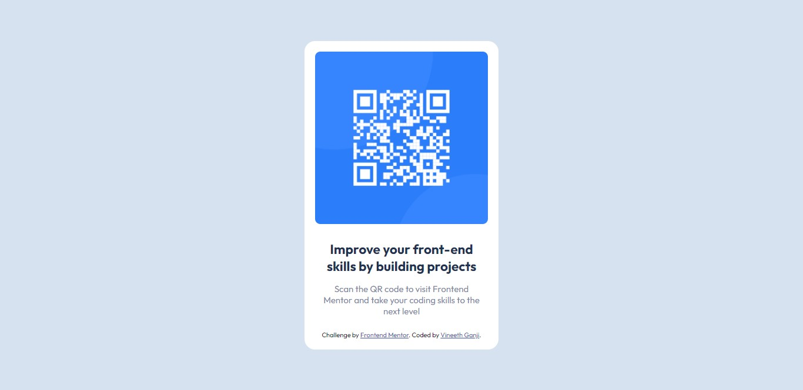

# Frontend Mentor - QR code component solution

This is a solution to the [QR code component challenge on Frontend Mentor](https://www.frontendmentor.io/challenges/qr-code-component-iux_sIO_H). Frontend Mentor challenges help you improve your coding skills by building realistic projects. 

## Table of contents

- [Overview](#overview)
  - [Screenshot](#screenshot)
  - [Links](#links)
- [My process](#my-process)
  - [Built with](#built-with)
  - [What I learned](#what-i-learned)
  - [Continued development](#continued-development)

**Note: Delete this note and update the table of contents based on what sections you keep.**

## Overview
    This is small challenge from Frontend Mentor for qr code component using HTML and CSS.

### Screenshot



### Links

- Solution URL: [](https://vineeth-ganji.github.io/QR-code-component-main/)
- Live Site URL: [Add live site URL here](https://your-live-site-url.com)

## My process

### Built with

- Semantic HTML5 markup
- CSS custom properties
- Flexbox
- CSS Grid
- Mobile-first workflow

### What I learned

In this challenge I have learned about flex model and how to use it.

To see how you can add code snippets, see below:

```css
body{
  font-family: 'Outfit', sans-serif;
  background-color: hsl(212, 45%, 89%);
  font-size: 15px;
  height: 100vh;
  display: flex;
  align-items: center;
}
```

### Continued development

I am still a beginner to web development and really looking forward to solve challenges like this, learn from it and grow.
Also I want to learn more about different techniques used in frontend.
